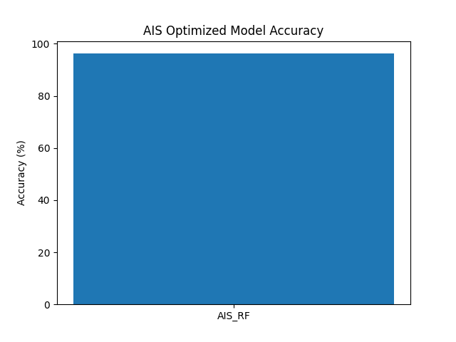

🧠 Company Failure Risk Prediction using Swarm Intelligence Algorithms
📌 Project Overview

This project focuses on analyzing and predicting company failure risk using real-world data of non-government companies struck off across states.

We apply multiple Swarm Intelligence Optimization Algorithms to improve model performance and compare their effectiveness.

🎯 Objectives

Analyze state-wise company failure trends

Predict company failure risk using machine learning

Optimize model performance using bio-inspired algorithms

Compare multiple optimization techniques

📊 Dataset

File: Non-Government-companies-struck-off-State-wise-distribution.csv

Description:

Contains state-wise distribution of companies that were struck off

Used to analyze failure patterns and predict risk

⚙️ Technologies Used

Python 🐍

Pandas, NumPy

Scikit-learn

Matplotlib

JSON / CSV handling

🧠 Algorithms Implemented
🔹 Base Model

Random Forest Regressor

🔹 Optimization Algorithms
Algorithm	Prefix
Artificial Immune System	ais_
Particle Swarm Optimization	pso_
Cuckoo Search Algorithm	csa_
Quantum PSO	qpso_
Bat Algorithm	ba_
Ant Lion Optimization	aloa_
Grey Wolf Optimization	gwoa_
Whale Optimization	woa_
📂 Project Structure
Company Failure Risk Prediction/
│
├── dataset.csv
│
├── ais_*.csv / png / json
├── pso_*.csv / png / json
├── csa_*.csv / png / json
├── qpso_*.csv / png / json
├── ba_*.csv / png / json
├── aloa_*.csv / png / json
├── gwoa_*.csv / png / json
├── woa_*.csv / png / json
│
├── results.csv
├── predictions.csv
├── summary.json
│
└── README.md
📈 Output Files

Each algorithm generates:

📊 CSV Files

<prefix>_results.csv → Model performance

<prefix>_predictions.csv → Actual vs Predicted values

📈 Graphs

<prefix>_accuracy_graph.png

<prefix>_prediction_graph.png

<prefix>_heatmap.png

<prefix>_metrics_graph.png

📄 JSON

<prefix>_summary.json

Best parameters

Accuracy

MSE

R² Score

📊 Evaluation Metrics

MSE (Mean Squared Error)

R² Score

Accuracy (%) = R² × 100

🔬 Workflow

Load dataset

Data preprocessing:

Handle missing values

Encode categorical data

Normalize features

Split dataset (Train/Test)

Apply optimization algorithms

Train optimized RandomForest model

Evaluate performance

Save results and visualizations

📉 Visualizations

Accuracy comparison graphs

Prediction vs Actual graphs

Correlation heatmaps

Model performance charts

🏆 Key Highlights

Implementation of 8 advanced optimization algorithms

Real-world dataset analysis

Full pipeline:

Data → Model → Optimization → Visualization

High-quality outputs for research & resume

🚀 How to Run
Step 1: Install Dependencies
pip install pandas numpy matplotlib scikit-learn
Step 2: Update File Path

In each script:

data_path = "your_dataset_path_here"
Step 3: Run Any Algorithm
python ais_code.py
python pso_code.py
python csa_code.py
...
📌 Results Interpretation

Higher Accuracy (%) → Better model

Lower MSE → Better predictions

Compare all algorithms to find the best performer

🔥 Future Enhancements

Combine algorithms (Hybrid models)

Add Deep Learning (LSTM, ANN)

Build Streamlit Dashboard

Deploy as Web Application

📚 Applications

Business risk analysis

Investment decision support

Government policy insights

Startup ecosystem analysis

👨‍💻 Author
Sagnik Patra
